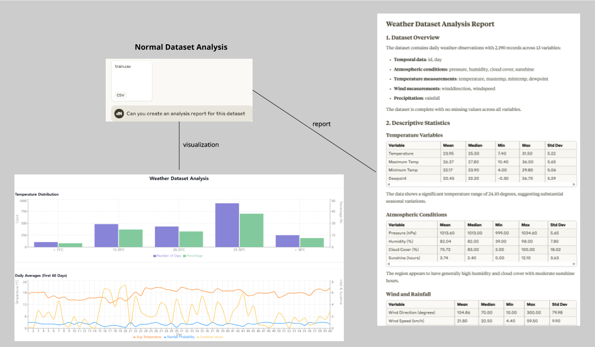
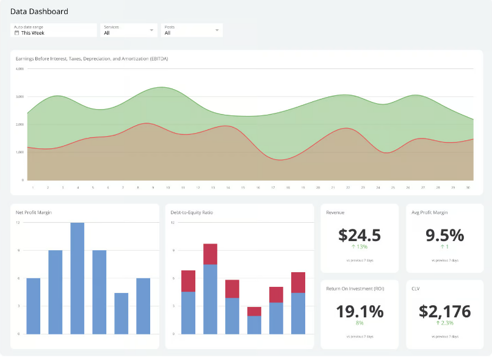
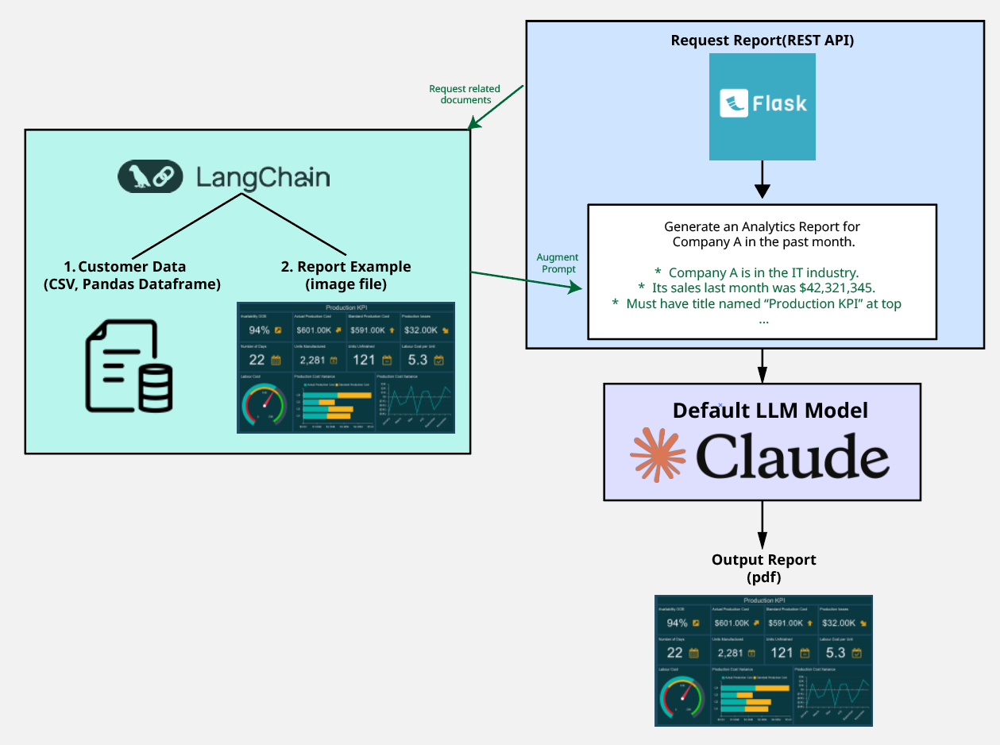

# Why Do We Need This Project?

- LLMs create good data report, but it creates it in its own style.

- Most companies **require these kinds of reports done in a given format**

ex)

- By using LLM tuning methods, we aim to **customize the LLM to give reports in the desired format by:**
   1) Giving it information about the desired report format of the company.
   2) Use RAG methods to give the company-private data that needs to be analyzed, while storing it in a safe environment.

## Architecture

## Tech Stack
* Python, Flask, Pandas, Numpy, Langchain
